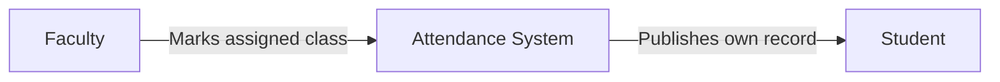
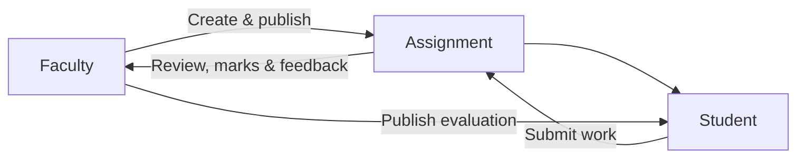
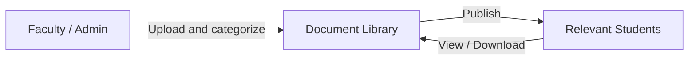
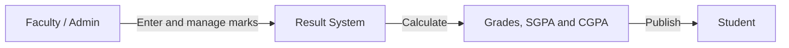
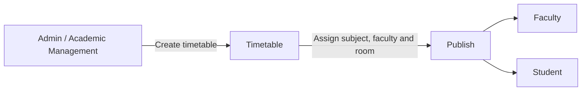
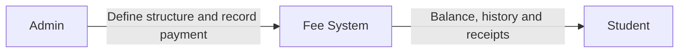
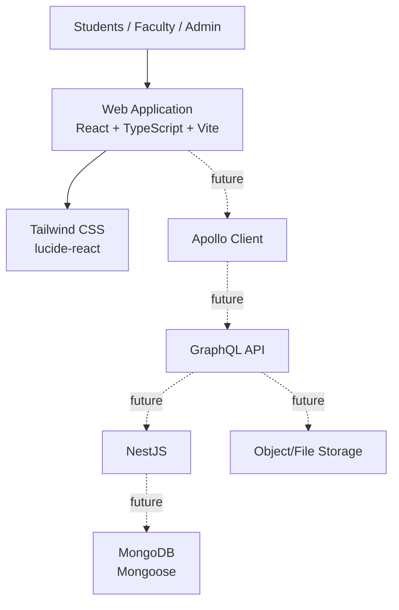
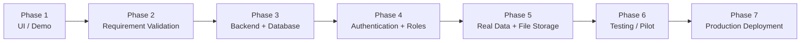

# College Management System

## A centralized digital platform for managing academic and college operations

> 🚧 **Project Status:** UI Demo / Frontend Development
>
> The current system uses mock data for demonstration. Backend services, database integration and production authentication will be implemented in later phases.

The College Management System connects **College Administration → Faculty → Students** in one platform. It is designed to make academic information easier to manage, easier to find and available to the right people at the right time.

The product is being developed for engineering and degree colleges. Examples in this README and in the current interface are demonstration data and do not represent any specific college's final requirements.

## 1. Project Overview

The system is designed to centralize academic and college operations across:

- Students
- Faculty
- Departments
- Programs
- Batches
- Years and semesters
- Sections
- Subjects
- Timetable
- Attendance
- Examinations
- Results
- Assignments
- Documents
- Fees
- Reports

The academic structure is intended to remain configurable so that different colleges, departments and programs can use the platform without being hard-coded for one institution.

## 2. Problem Statement

Colleges often manage academic information across separate files, systems and manual processes. This can make it difficult to:

- Maintain one reliable view of academic information.
- Record and review attendance efficiently.
- Track assignments and submissions.
- Give students self-service access to routine information.
- Organize documents, notes and question papers.
- Publish and access examination results.
- Provide visibility into fee status and payment history.
- Control access according to each user's responsibility.

## 3. Objectives

- Centralize academic information.
- Provide role-based access for administration, faculty and students.
- Give students self-service access to their academic information.
- Help faculty manage assigned academic activities.
- Give administrators centralized control of college operations.
- Reduce repetitive manual work.
- Improve transparency for students and academic staff.
- Provide a scalable foundation for future integrations.

## 4. Who Uses the System?

```mermaid
flowchart TD
	CMS["College Management System"]

	CMS --> ADMIN["ADMIN"]
	CMS --> FACULTY["FACULTY"]
	CMS --> STUDENT["STUDENT"]

	ADMIN --> A1["Manage Students & Faculty"]
	ADMIN --> A2["Manage Academic Structure"]
	ADMIN --> A3["Manage Timetable"]
	ADMIN --> A4["Manage Exams & Results"]
	ADMIN --> A5["Manage Attendance"]
	ADMIN --> A6["Manage Documents & Fees"]
	ADMIN --> A7["Reports"]

	FACULTY --> F1["View Assigned Classes"]
	FACULTY --> F2["Mark Attendance"]
	FACULTY --> F3["Create & Evaluate Assignments"]
	FACULTY --> F4["Enter Marks"]
	FACULTY --> F5["Upload Academic Documents"]

	STUDENT --> S1["View Attendance"]
	STUDENT --> S2["View Subjects & Timetable"]
	STUDENT --> S3["View Exams & Results"]
	STUDENT --> S4["Submit Assignments"]
	STUDENT --> S5["View & Download Documents"]
	STUDENT --> S6["View Fees"]
	STUDENT --> S7["Manage Profile"]
```



### Administration

Administration manages the institution-wide academic structure, users, schedules, examinations, results, fees, documents and reports.

### Faculty

Faculty members work with their assigned subjects, classes and students. They record attendance, create and evaluate assignments, enter marks and publish approved academic documents through future controlled workflows.

### Students

Students use the portal to view their own academic information, including attendance, subjects, timetable, exams, results, assignments, documents, fees and permitted profile details.

## 5. Information Flow

The system is designed around clear ownership. Each workflow identifies who creates or manages information and who receives it.

### Attendance



Faculty records attendance for assigned classes. A student views only their own attendance and attendance percentage.

### Assignments



### Documents



### Results



### Timetable



Students and faculty view the centrally managed timetable. They do not independently modify it.

### Fees



## 6. Student Portal Modules

The current UI demo includes these student-facing modules:

| Module | Student capability |
| --- | --- |
| Dashboard | View academic summary, classes, notices and progress indicators. |
| Attendance | View overall, subject-wise and session-based attendance. |
| Subjects | View semester subjects, credits, faculty and attendance. |
| Timetable | View daily, weekly and monthly class schedules. |
| Exams | View examination schedules, rooms, durations and status. |
| Results | View marks, grades, SGPA, CGPA and class/section rank. |
| Assignments | View assignments, submit work and view evaluation feedback. |
| Documents | Search, view and download academic documents. |
| Fees | View fee breakdown, pending balance, payment history and receipts. |
| Profile | View personal and academic information and edit permitted contact details. |

Notices and Notifications are intentionally deferred in the current demo.

## 7. Current Demo Scope

The current frontend demonstrates navigation and user-facing workflows with mock data and local state.

### Included in the demo

- Student dashboard and persistent student layout.
- Client-side navigation without full page refreshes.
- Attendance calendar with session-level details.
- Subject browsing, search, filtering and subject details.
- Day, week and month timetable views.
- Exam schedule with status and filters.
- Results with marks, grades, SGPA, CGPA and class rank.
- Assignment viewing and frontend-only submission simulation.
- Document search, preview placeholder and download feedback.
- Fee summary, payment history and receipt preview.
- Profile viewing and local editing of permitted contact information.

### Not yet connected

- Backend APIs
- Database persistence
- Production authentication
- Real file storage
- Real payment processing
- Production notifications

All displayed names, dates, amounts and academic records are examples for UI demonstration until college-approved data is connected.

## 8. Access Principles

| Area | Student | Faculty | Admin |
| --- | --- | --- | --- |
| Attendance | View own | Manage assigned classes | Manage all |
| Timetable | View | View assigned | Create, update and publish |
| Assignments | View and submit | Create and evaluate | Manage |
| Results | View own | Enter/manage assigned | Manage and publish |
| Documents | View and download | Upload/manage assigned | Manage all |
| Fees | View own | View if permitted | Manage |
| Profile | View own and edit permitted contact fields | Own profile | Manage users |

## 9. Future Scope

The following capabilities may be considered after requirements are confirmed with the college:

- Notices and notifications
- Online fee payment
- Parent or guardian portal
- Library management
- Hostel management
- Transport management
- Placement management
- Certificates and ID cards
- Mobile application
- Advanced academic and management reports
- Integration with an existing ERP or college system

These items are future scope and are not represented as completed functionality in the current demo.

## 10. Technical Overview

The project is being built incrementally with a React frontend and a planned NestJS/GraphQL backend.



The frontend currently uses local mock data to demonstrate the product. The future production architecture will add secure APIs, persistence, role-based authorization, file storage and audit history.

## 11. Project Structure

```text
College management system/
├── frontend/   # React + TypeScript + Vite + Tailwind CSS
└── backend/    # NestJS backend foundation
```

The application is organized around Student, Faculty and Admin roles. Development is incremental so each module can be reviewed before backend integration.

## 12. Local Development

### Frontend

```bash
cd frontend
npm install
npm run dev
```

The frontend development server provides the current UI demo. Available scripts are:

```bash
npm run dev
npm run build
npm run lint
npm run preview
```

### Backend

The backend is a NestJS foundation and is not yet connected to the current mock-data frontend workflows.

```bash
cd backend
npm install
npm run start:dev
```

### Supporting services

The repository includes `docker-compose.yml` for local supporting services as the backend and persistence layers are implemented.

## 13. Information Required From the College

Before production implementation, the following decisions should be confirmed:

1. What departments and programs does the college have?
2. How are batches, years, semesters and sections structured?
3. Who can create and publish timetables?
4. What attendance rules apply?
5. What examination types and grading systems are used?
6. Who can upload and publish academic documents?
7. What fee categories and receipt rules exist?
8. What reports are required by management and academic coordinators?
9. Is online fee payment required?
10. Are parent accounts required?
11. Are SMS or email notifications required?
12. Does an existing ERP or student information system need integration?

## 14. Implementation Roadmap



1. **UI / Demo:** Review screens, navigation and user-facing workflows.
2. **Requirement Validation:** Confirm academic structure, permissions and college-specific rules.
3. **Backend + Database:** Implement APIs, data models and controlled persistence.
4. **Authentication + Roles:** Add secure login and role-based authorization.
5. **Real Data + File Storage:** Connect approved records, documents and storage.
6. **Testing / Pilot:** Test with selected departments and representative users.
7. **Production Deployment:** Deploy, train users and establish support processes.

## 15. Notes for Stakeholders

This document describes the current product direction and UI demo. College-specific names, policies, grading rules, fee structures, permissions and reporting requirements should be confirmed during requirement validation before production data is connected.
